# 🔐 Zero Trust AWS Cloud Security Lab

## 📌 Overview
This project demonstrates a **Zero Trust cloud security architecture** implemented in AWS using **identity-first access, private networking, centralized logging, and Infrastructure as Code (Terraform)**.

The environment was intentionally designed to reflect **real-world enterprise cloud security practices**, prioritizing **prevention, visibility, and auditability** over convenience.

### Key Design Principles
- ❌ **No public EC2 access**
- 🔐 **IAM role-based authentication (no static credentials)**
- 📜 **Centralized, tamper-resistant audit logging**
- 🌐 **Private service access via VPC endpoints**
- 🧩 **All infrastructure managed as code (Terraform)**

---

## 🧱 Architecture Overview
This environment follows a **Zero Trust model**, where trust is never implicit and all access is explicitly verified.

📄 Detailed design documentation:
- 👉 [Architecture Overview](ARCHITECTURE.md)

High-level architecture characteristics:
- Private VPC with isolated subnets
- No inbound internet exposure
- AWS Systems Manager used instead of SSH
- AWS service access routed through VPC endpoints
- Full logging of identity and API activity

---

## 🧩 Infrastructure as Code (Terraform)

All resources are provisioned using Terraform to ensure **repeatability, auditability, and consistency**.

📁 Terraform configuration:
- 👉 [Terraform Configuration](terraform/README.md)

### ✅ Successful Deployment
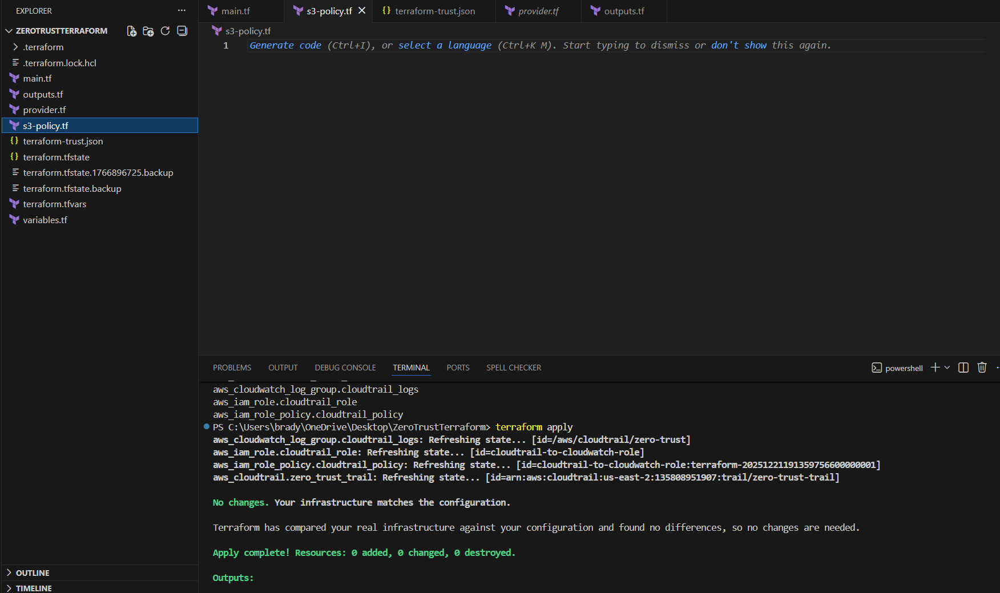

Terraform applies cleanly with no manual console configuration.

---

### 📋 Resource State Validation
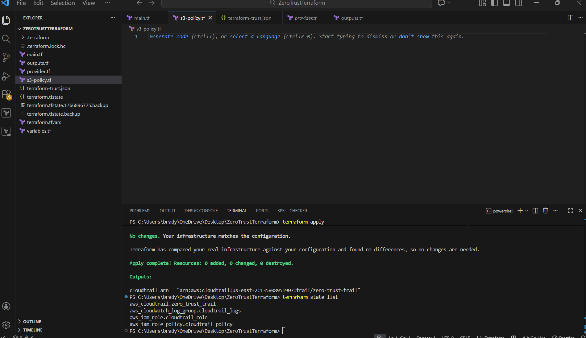

Terraform state tracking enables:
- Drift detection
- Lifecycle management
- Controlled teardown to avoid unnecessary costs

---

## 🔐 Identity & Access Management (IAM)

IAM is the **primary enforcement layer** of the Zero Trust model.

### 🧾 IAM Roles Defined as Code
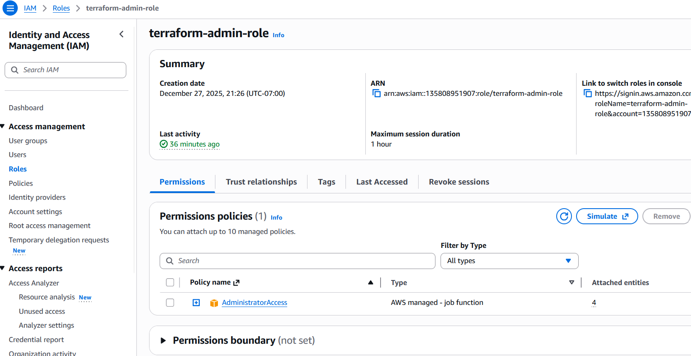

- Roles and trust policies managed via Terraform
- No long-term access keys
- Clear separation of duties

---

### 🚫 Zero Trust Policy Enforcement
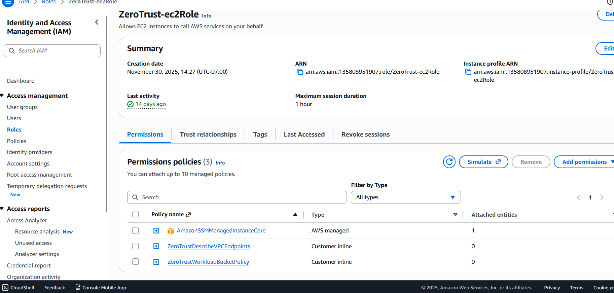

Policies follow:
- Explicit allow
- Implicit deny
- Least-privilege access

---

### 🔁 Secure Role Assumption (STS)
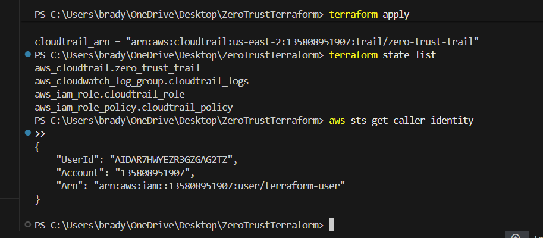

Access is granted using **temporary credentials**, reducing blast radius and credential exposure.

---

## 🖥️ Secure Compute (EC2)

### 🚫 Private EC2 (No Public IPs)
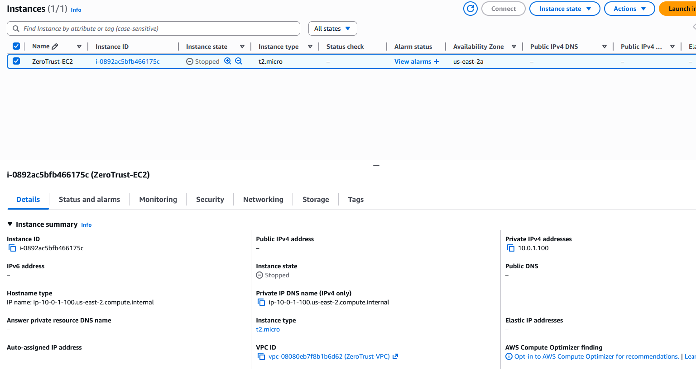

EC2 instances are:
- Deployed without public IPs
- Not accessible via SSH
- Managed securely through AWS services only

---

## 🌐 Private Networking & VPC Endpoints

### 🔒 Private S3 Access
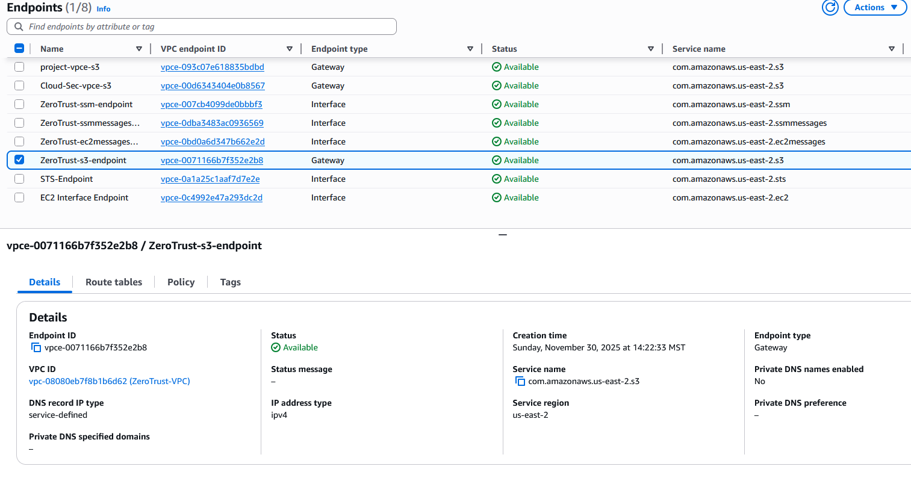

VPC endpoints ensure:
- AWS traffic stays on the AWS backbone
- No dependency on internet gateways
- Reduced attack surface

---

## 🪣 Secure Storage (S3)

### 🔐 Restricted Logging Bucket
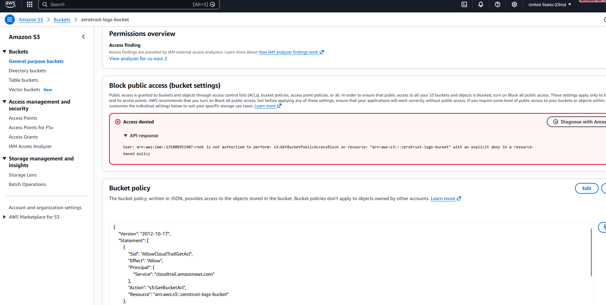

Logging buckets are locked down with restrictive policies to prevent unauthorized access.

---

### 🚫 Public Access Fully Blocked
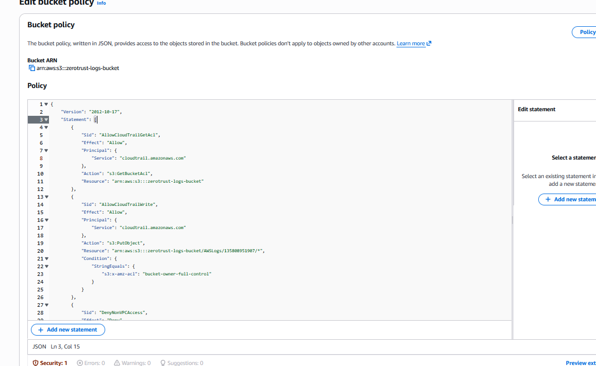

Public access is disabled at both the bucket and account level.

---

### ❌ Intentional Access Denial
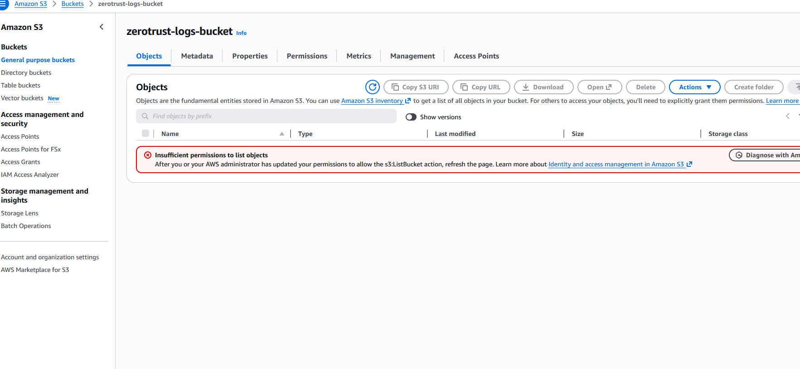

The **access denied behavior is intentional**.

The CloudTrail bucket policy:
- Allows write access only from the CloudTrail service
- Explicitly denies all other principals
- Prevents administrators from casually browsing or modifying logs

This ensures:
- Log integrity
- Non-repudiation
- Audit readiness

---

## 📜 Logging & Monitoring

### 📘 CloudTrail Enabled
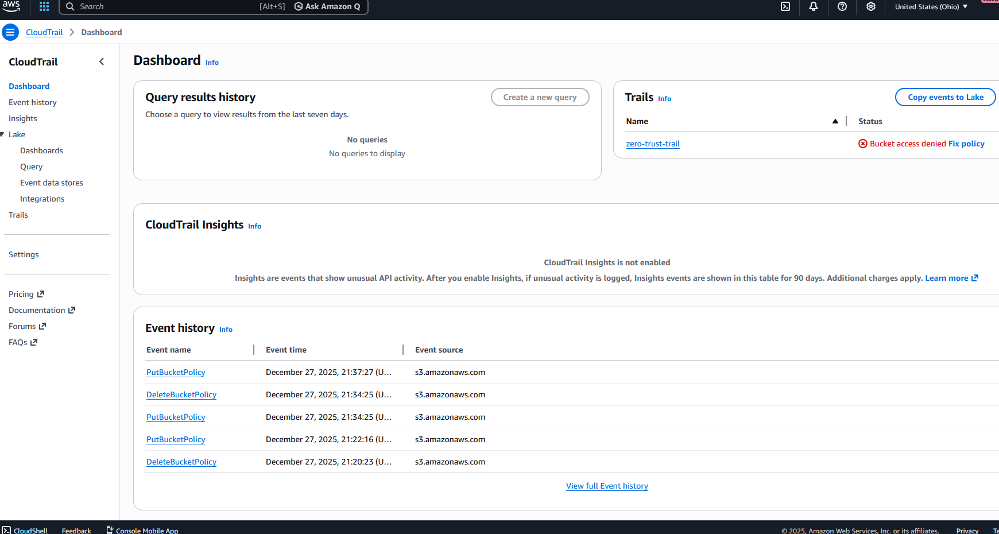

CloudTrail captures:
- API activity
- IAM changes
- Security-relevant events across all regions

---

### 📊 CloudWatch Logging
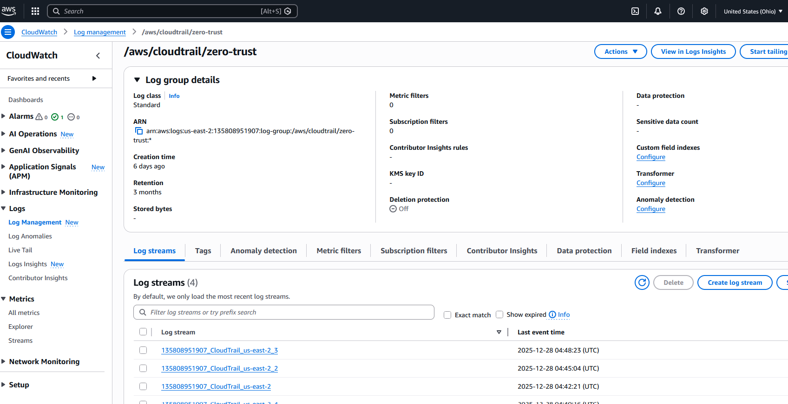

CloudWatch provides centralized visibility to support:
- Monitoring
- Troubleshooting
- Incident response workflows

---

## ⚠️ Challenges & Resolutions

📄 Full documentation:
- 👉 [Issues and Resolutions](ISSUES-AND-RESOLUTIONS.md)

### Key Challenges Addressed
- CloudTrail bucket access denied errors (validated as correct Zero Trust behavior)
- Terraform permission errors resolved through least-privilege refinement
- Private subnet connectivity solved via VPC endpoints instead of internet access

These challenges reinforced **security-first decision making** and real-world troubleshooting skills.

---

## 🔐 Security Controls Summary

📄 Detailed breakdown:
- 👉 [Security Controls](SECURITY.md)

Controls implemented include:
- Identity-first access control
- Least privilege IAM enforcement
- No public infrastructure exposure
- Tamper-resistant logging
- Infrastructure as Code governance

---

## 📂 Repository Structure

